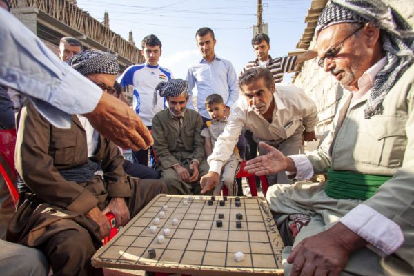

# Dama

[Here](https://github.com/nada-attia/dama/blob/main/INSTALL.md) are instructions on how to run the game locally and play it through terminal.

## Background

Dama (also known as Turkish Draughts) is a variant of draughts that is played in Turkey, Greece, Egypt, Kuwait, Lebanon, Syria, Jordan, Iraq, and other Middle Eastern countries. In this information age, this 5000+ year old game is losing popularity. You can find a video by Al Jazeera English [here](https://www.youtube.com/watch?v=hc-XDUwFFTE) discussing this.

As group members of Middle Eastern background, this game carries cultural significance to us, and our implementation of the game is an effort to keep the game alive.

## Rules of the Game

- The game starts off with an 8x8 board with 16 pieces lined up on two rows for each color with the last row empty on each side.
- White starts the game.
- The pieces start off as Men pieces that can move forward, left, and right one square. The pieces cannot move backward or diagonally.
- If pieces of the other player are directly infront of or to either side of the player, the player must jump and capture the other piece.
- If there are multiple jumps available, the player can choose one.
- When a piece reaches the last row, it upgrades to a Lady (Dama) piece and can move any number of squares forward, sideways, but not backward or diagonally.
- There is no distinction between capturing a Lady piece and a Man piece; they each count as one piece.
- The game ends when one player can make no more moves or has no more remaining pieces (all their pieces have been captured), in which case the other player wins
